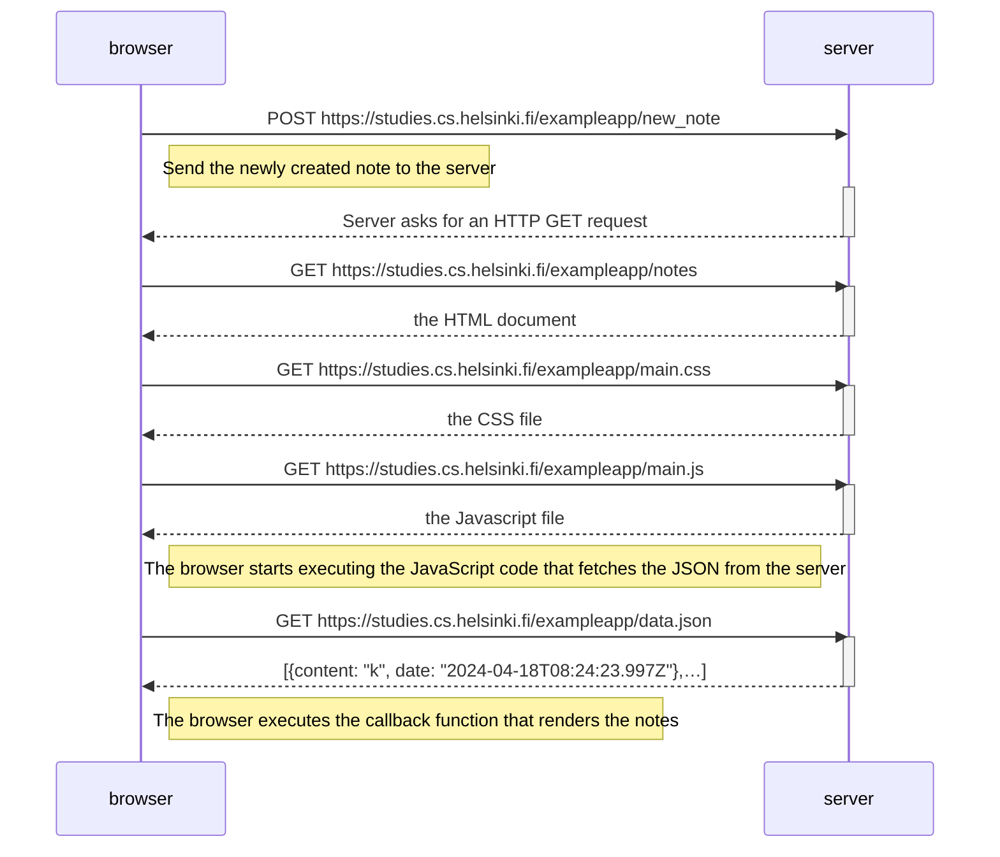

```mermaid
sequenceDiagram
    participant browser
    participant server

    browser->>server: POST https://studies.cs.helsinki.fi/exampleapp/new_note

    Note right of browser: Send the newly created note to the server

    activate server
    server-->>browser:  Server asks for an HTTP GET request
    deactivate server    

    browser->>server: GET https://studies.cs.helsinki.fi/exampleapp/notes

    activate server
    server-->>browser: the HTML document
    deactivate server

    browser->>server: GET https://studies.cs.helsinki.fi/exampleapp/main.css

    activate server
    server-->>browser: the CSS file
    deactivate server

    browser->>server: GET https://studies.cs.helsinki.fi/exampleapp/main.js

    activate server
    server-->>browser: the Javascript file
    deactivate server

    Note right of browser: The browser starts executing the JavaScript code that fetches the JSON from the server

    browser->>server: GET https://studies.cs.helsinki.fi/exampleapp/data.json

    activate server
    server-->>browser: [{content: "k", date: "2024-04-18T08:24:23.997Z"},…]
    
    deactivate server

    Note right of browser: The browser executes the callback function that renders the notes
```
