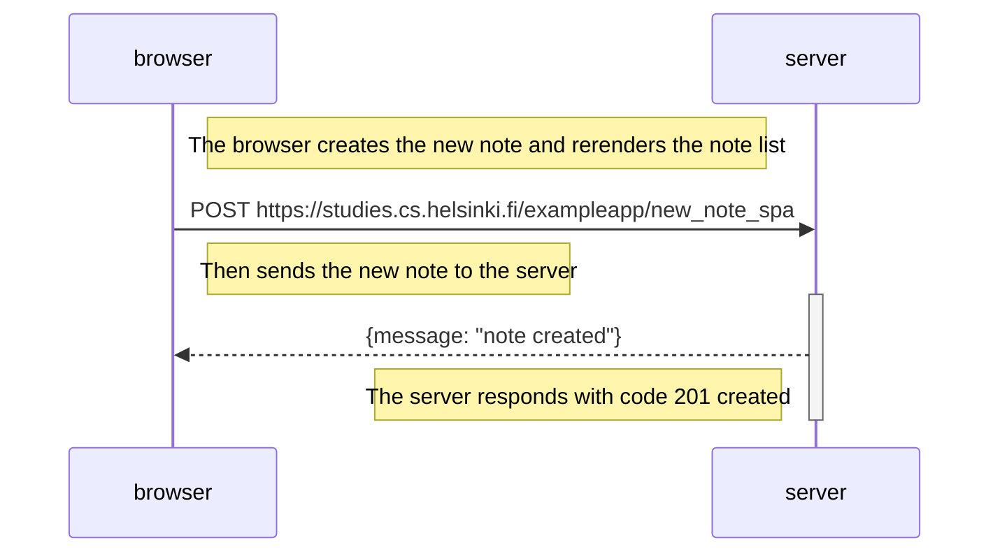

```mermaid
sequenceDiagram
    participant browser
    participant server

    Note right of browser: The browser creates the new note and rerenders the note list

    browser->>server: POST https://studies.cs.helsinki.fi/exampleapp/new_note_spa

    Note right of browser: Then sends the new note to the server

    activate server
    server-->>browser: {message: "note created"}
    Note left of server: The server responds with code 201 created
    deactivate server
```
