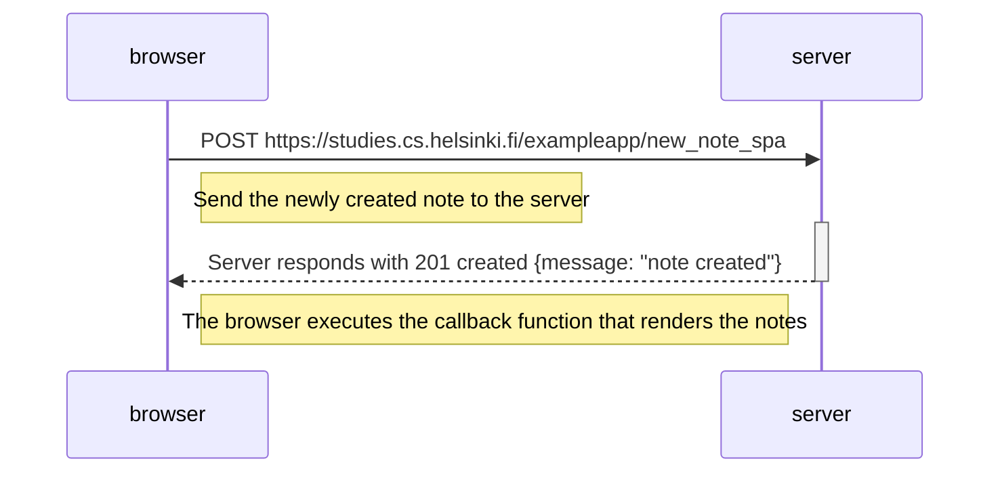

```mermaid
sequenceDiagram
    participant browser
    participant server

    browser->>server: POST https://studies.cs.helsinki.fi/exampleapp/new_note_spa

    Note right of browser: Send the newly created note to the server

    activate server
    server-->>browser: Server responds with 201 created {message: "note created"}
    deactivate server

    Note right of browser: The browser executes the callback function that renders the notes
```
